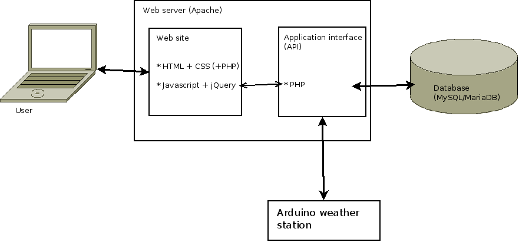

arduinows
=========
This is a weather station project.
It consists of two parts:
* Arduino-based weather station and
* Data collection API and website that displays historical data.

Architecture of the system is shown below:

Arduino weather station (ArduinoWS)
-----------------------------------
Hardware used to collect weather data and sending it to web service.
More info in [arduino](arduino/README.md) folder.

PHP website and data collection
-------------------------------
Website that shows pretty graphs and an API to which ArduinoWS sends weather data.
More info in [website](website/README.md) folder.

This is software used in my diploma thesis which can be found at [this link](https://www.dropbox.com/s/7fwu3h0v0itm1gu/Matej-Repinc-diploma-final-v2.pdf).
